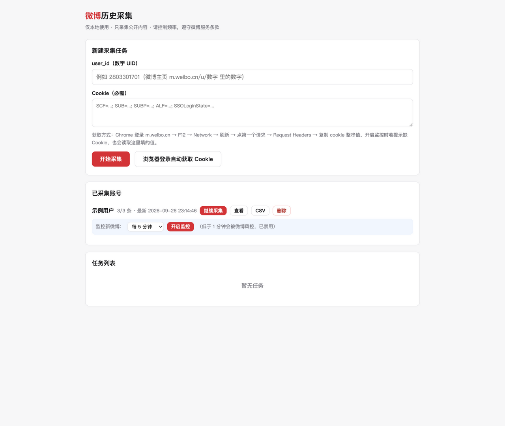
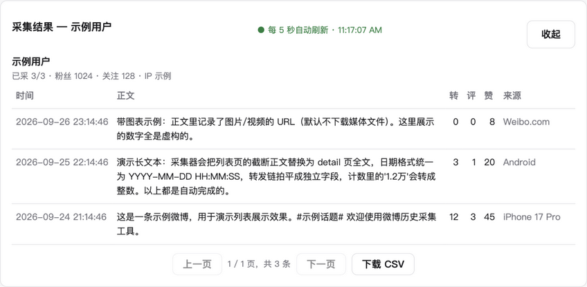

# 微博历史采集 weibo-collector

[](https://github.com/samxie2752/weibo-collector/actions/workflows/ci.yml)
[](LICENSE)

本地 Web 小工具：填入 user_id，自动抓取任意公开微博账号的**全部历史微博**，存入本地 SQLite，页面上实时查看采集进度与内容，支持断点续采、增量更新、后台监控新微博、一键导出 CSV。

> ⚠️ **合规声明**：本项目仅用于个人备份与学习研究，只采集公开可见内容，不做任何登录凭据破解或反爬绕过。使用请遵守《微博服务使用协议》及相关法律法规，自行控制频率，勿用于商业用途。本项目与微博官方无关，产生的数据请勿二次分发。

## 界面





## 功能特性

- **全量采集**：从最新微博一路翻到 2009 年，正文/时间/来源/转评赞/转发链/图片视频 URL 全部入库
- **实时查看**：采集进行中即可点"实时查看"，每 5 秒自动刷新，看着数据逐条流入
- **断点续采**：验证码/重启/中断后自动从断点继续（页码记在 SQLite 里），按 bid 去重不采重
- **增量更新**：已采完的账号再跑一次，只追新微博
- **后台监控**：定时检查账号时间线头部（60 秒~30 分钟），新微博自动入库并在页面提示
- **一键续采**：账号卡片展示断点/风控状态，点"继续采集"经三道校验后自动续跑
- **自动获取 Cookie**：弹出浏览器窗口登录一次，Cookie 自动捕获、保存、复用（Playwright 半自动）
- **CSV 导出**：全量数据一键导出，Excel 可直接打开
- **防封体系**：随机延迟 + 全局节流 + 会话上限自动休息 + 风控冷却时间衰减（详见下文）

## 快速开始

要求 Python 3.9+。

```bash
git clone https://github.com/samxie2752/weibo-collector.git
cd weibo-collector
python3 -m venv .venv
.venv/bin/pip install -r requirements.txt

# 可选：启用"浏览器登录自动获取 Cookie"功能（约 300MB 一次性下载）
.venv/bin/pip install playwright && .venv/bin/playwright install chromium

.venv/bin/uvicorn app.main:app --host 127.0.0.1 --port 8765
```

打开 http://127.0.0.1:8765 ：

1. 填 **user_id**（数字 UID，微博移动端主页 `m.weibo.cn/u/数字` 里的数字）
2. 获取 **Cookie**（二选一）：
   - 点"**浏览器登录自动获取 Cookie**"，在弹出的窗口里登录微博（扫码/账密均可），成功后自动填入并保存
   - 手动：Chrome 登录 m.weibo.cn → F12 → Network → 刷新 → 第一个请求 → Request Headers → 复制整串 cookie
3. 点"开始采集"，在页面上看进度、实时内容；完成后下载 CSV

> 💡 不想配 Cookie？运行 `.venv/bin/python scripts/seed_demo.py` 写入一个虚构演示账号（uid 1000000000），先体验浏览/导出等界面功能（`--clean` 可删除）。

## 工作原理

- 接口：用户资料 `containerid=100505{uid}`，微博列表 `containerid=230413{uid}` 翻页，长微博从 `m.weibo.cn/detail/{id}` 抠内嵌 JSON 取全文
- 存储：每账号 `data/{uid}/weibo.db`（SQLite：`user` + `weibo` + `meta` 表），逐条提交，采集过程即可查
- 采集方式：自研 requests 实现（无浏览器依赖），接口行为参考了 [dataabc/weibo-crawler](https://github.com/dataabc/weibo-crawler) —— 致谢！

### 防封体系

| 机制 | 参数 |
|---|---|
| 页间延迟 | 8~15 秒随机 |
| 全局节流 | 任意两次微博请求 ≥3 秒（多任务/监控共享一把闸） |
| 批次休息 | 每 5 页歇 30~60 秒 |
| 会话上限 | 连续 300 条或 8 分钟 → 自动长休息 3~5 分钟 |
| 风控冷却 | 2→4→8→…分钟指数递增（封顶 15 分钟），每过 30 分钟自动衰减一级 |
| 指纹轮换 | 5 组 UA × 3 语言 × 3 Referer 随机组合 |
| 失败退避 | 指数退避重试 5 次 |
| 任务互斥 | 采集运行时该账号的监控自动暂停；同账号任务防重复提交 |

触发验证码/登录墙时不会反复撞墙：任务转入"需人工验证"（监控转入拦截状态），页面上给链接，人工过完验证点继续，断点续采。

## API

| 路由 | 作用 |
|---|---|
| `POST /api/collect` | `{user_id, cookie}` 创建采集任务 |
| `GET /api/tasks` / `POST /api/tasks/{id}/resume` | 任务列表 / 验证后续采 |
| `GET /api/accounts` | 已采集账号列表（含监控状态、断点/风控元数据） |
| `POST /api/accounts/{uid}/continue` | 一键断点续采（校验重复任务与 Cookie 可用性） |
| `GET /api/accounts/{uid}/weibos?page=` | 分页浏览某账号数据 |
| `GET /api/accounts/{uid}/export` | 导出 CSV |
| `DELETE /api/accounts/{uid}` | 删除该账号全部本地数据 |
| `POST /api/accounts/{uid}/monitor` | `{interval_seconds, cookie?}` 开启监控 |
| `DELETE /api/accounts/{uid}/monitor` | 停止监控 |
| `POST /api/cookie/browser` | 弹出浏览器登录页自动捕获 Cookie（`{target_uid?}`） |
| `GET /api/cookie/browser/{sid}` | 轮询捕获状态：launching/waiting/success/failed |

## 项目结构

```
app/crawler.py      采集核心（会话/接口/解析/防封）
app/store.py        SQLite 存储 + 分页查询 + CSV 导出 + 进度元数据
app/tasks.py        采集任务队列（串行）+ 状态机 + 风控冷却
app/monitor.py      后台监控（每账号线程，增量检查）
app/browserlogin.py 浏览器登录自动获取 Cookie（Playwright 有头窗口）
app/main.py         FastAPI 路由
static/index.html   单页前端（原生 JS，无构建）
scripts/probe.py    接口探活
scripts/probe_qr.py wap 扫码协议探活（记录了为何放弃纯接口扫码：二维码为加密私有格式）
scripts/seed_demo.py 生成虚构演示数据（免 Cookie 体验界面）
scripts/selftest.py 离线自测（mock HTTP，50 项断言，CI 跑的就是它）
```

## 开发与测试

```bash
.venv/bin/python scripts/selftest.py   # 离线自测，零网络依赖
```

服务仅绑定 127.0.0.1，纯本地使用。Cookie 只存本地 `data/`（已在 `.gitignore` 中），请勿分享或提交。

## 已知限制

- 匿名（无 Cookie）访问会被登录墙拦下（接口返回 `ok=-100`），Cookie 是硬前提
- 采不到"仅自己可见"和已删除的微博；数量缺口通常是这部分
- Cookie 有效期约 3 个月，失效后换新即可（工具会停在验证状态引导你）
- 历史很久的账号全量采集约 1.5~2.5 小时（页间延迟是刻意的防封措施）

## 致谢

- [dataabc/weibo-crawler](https://github.com/dataabc/weibo-crawler) —— 接口行为研究的首要参考
- 所有公开分享微博 wap 接口经验的社区开发者

## License

[MIT](LICENSE)
